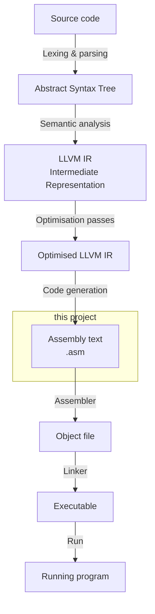

date: 2026-03-19
license: CC-BY-4.0
slug: llvm-ia16-intro
summary: An introduction to a learning journal series about building an LLVM backend from scratch, targeting the 8086.
tags: 8086, backend, compilers, ia16, llvm
title: Learning to write an LLVM backend, one small step at a time

I can read x86 assembly reasonably well.
I understand what the compiler is *trying* to do when I look at its output.
But ask me how it gets there — how a compiler decides which registers to use,
how it turns an abstract operation into concrete instructions,
what all those optimisation passes are actually doing — and I'd have to admit I don't really know.
I've always treated the compiler as a black box.
This project is about opening it.

The target architecture chose itself.
I've spent years reading about computer history —
[OS/2 Museum](https://www.os2museum.com/) is a favourite — and the 8086 sits at the centre of a lot of it.
I'm not an expert: I can't write large programs in assembler,
but I understand the instruction set, I know the registers, I have a feel for the addressing modes.
Using hardware I already know means one fewer unknown when the compiler does something unexpected.

So: building an LLVM backend for the 8086, from scratch, documenting every step.
This is a learning journal.

## The full picture: what a compiler does

Before getting to the part I'm actually going to build, it helps to look at the whole pipeline.
A compiler takes source code and produces machine instructions — but it does this in several steps,
each with a clear input and output.



The **Intermediate Representation** is the key abstraction in the middle.
Instead of going straight from source code to machine instructions —
which would need a separate optimiser for every language and every CPU —
compilers first translate everything into a common form that is not tied to any specific architecture.
Optimisation passes work on that form,
and then the code generator translates the optimised result into real instructions for a specific machine.

In [GCC](https://gcc.gnu.org/), this intermediate form is called
[GIMPLE](https://gcc.gnu.org/onlinedocs/gccint/GIMPLE.html) at the high level and
[RTL](https://gcc.gnu.org/onlinedocs/gccint/RTL.html) (Register Transfer Language) closer to the machine.
In [LLVM](https://llvm.org/), it is called
[LLVM IR](https://llvm.org/docs/LangRef.html) — a readable, typed representation that looks a bit like
assembly for an imaginary machine.
For example, a function that adds two 16-bit integers looks like this in LLVM IR:

```llvm
define i16 @add(i16 %a, i16 %b) {
  %r = add i16 %a, %b
  ret i16 %r
}
```

The code generator — the **backend** — takes optimised LLVM IR and translates it into assembly for a specific target.
That is what I'm going to build.

## Why LLVM and not GCC?

A fair question, since [gcc-ia16](https://github.com/tkchia/gcc-ia16) already exists —
a real, working GCC port targeting the 8086.
I could just use that.
But this project is about learning, not about producing the most practical toolchain.

GCC's backend is older and more tangled up with the rest of the compiler.
LLVM's backend is a more self-contained module with cleaner interfaces —
or at least that's what I've read.
I'll find out if that's true.
LLVM IR is also easy to write by hand,
which matters because I won't be using a C frontend in the early stages.

There's also the ecosystem: LLVM ships with backends for many architectures —
from small embedded targets to large general-purpose CPUs.
Some of them are simple enough to learn from —
I expect to figure out which ones in the next few posts.

LLVM's existing x86 backend is also worth mentioning.
Modern 32-bit and 64-bit x86 has its roots in the 8086,
so there is probably a lot to learn from it.
But extending it to support 16-bit would be more complex than building a new backend in parallel —
the existing backend carries a lot of assumptions about the target that would need to be unpicked.

## The goal structure

Having a clear set of goals helps keep scope under control — or so I hope.

**Dream goal:** [Clang](https://clang.llvm.org/) support — a full C/C++ frontend targeting the 8086.
Far enough away to be motivating without being a near-term distraction.

**Strategic goal:** a proper 8086 backend.
The Intel 8086 — 16-bit registers, segmented memory, DOS-era calling conventions.
An architecture quirky enough that several LLVM assumptions will probably need to be worked around.
I don't know exactly which ones yet.

**Operative goal:** [small memory model](#dos-memory-models) only.
The 8086's segmented memory is genuinely complex —
far pointers, multiple memory models, segment register management.
That's all real and eventually interesting, but it's not where I start.
LLVM works naturally with flat memory models,
and the DOS small memory model — one code segment, one data segment, no far pointers —
is close enough to flat that the framework handles it well.
One fewer thing to fight.

**Tactical goal:** a stripped-down 8086 subset.
Rather than targeting the full architecture right away,
I'll start with a small subset — a handful of instructions, a few registers, a simple calling convention.
Real hardware, real instruction encodings,
but only as much of the ISA as the simplest possible program needs.
I think that's a good way to separate "does the LLVM infrastructure work?"
from "is the hardware modelled correctly?" — but I'll see if that holds up in practice.

## Decisions made so far

A few choices have already been made — mostly about moving complex parts outside the backend.
These may turn out to be wrong; if so, I'll document that too.

### External assembler

The backend will emit [NASM](https://www.nasm.us/)-compatible text assembly.
NASM handles binary encoding and produces object files.
Binary encoding is complex enough on its own,
so keeping it out of scope until the core problems are solved makes sense.

### External linker and output formats

[NASM](https://www.nasm.us/) supports multiple output formats.
For a DOS `.EXE` executable, NASM can produce
[OMF](https://en.wikipedia.org/wiki/Relocatable_Object_Module_Format) (Object Module Format) object files,
which a DOS-compatible linker such as [OpenWatcom's WLINK](https://github.com/open-watcom/open-watcom-v2)
can then link into an executable.
For simpler flat `.COM` binaries, NASM can produce a flat binary directly.
The exact linker choice and output format is something I'll need to settle later.

### Development environment

The goal is to track current LLVM — starting with LLVM 22 on Linux.
As new versions are released I'll try to rebase, and note any API changes that affected the code.

### Validation target

The tactical goal is a backend that can correctly compile generic LLVM IR —
no target-specific intrinsics or attributes, just standard operations.
The first concrete test is a function that adds two 16-bit integers and returns the result,
written directly in LLVM IR,
compiled through [llc](https://llvm.org/docs/CommandGuide/llc.html) (the LLVM Static Compiler),
assembled with NASM, linked, and running under any x86 emulator —
[DOSBox](https://www.dosbox.com/), [QEMU](https://www.qemu.org/), or [PCjs](https://www.pcjs.org/) in the browser.
Whether a small instruction set is truly enough for generic IR is something I expect to find out along the way.

## A note on AI assistance

AI tools are part of this project —
for navigating the LLVM codebase, generating boilerplate,
and getting initial explanations of subsystems I haven't encountered before.
That includes helping draft this post —
the words get written together, but the decisions and the verification are mine.

They also get things wrong fairly often:
made-up API signatures, incorrect claims about how passes work, references to examples that don't exist.
I've learned to treat AI output as a starting point, not an answer,
and to check against actual LLVM source before accepting anything.
Where AI was relevant to a decision or discovery, I'll say so.

## What's next

Before the backend can generate any code, LLVM needs to know the target exists at all.
The very first step isn't writing any code generation logic —
it's getting LLVM to recognise `ia16` as a valid architecture at all.
That's where the next post starts.

The first milestone is not "correct code."
It's "no crash."
That's worth celebrating on its own terms.

---

The plan is simple: take the smallest possible program,
and push it through [llc](https://llvm.org/docs/CommandGuide/llc.html)
until real 8086 instructions come out the other end.

I don't know yet where it will break.

That's the point.

## Sidebar: DOS memory models { #dos-memory-models }

The Intel 8086 has a 20-bit physical address space — 1MB of addressable memory.
But its registers are only 16 bits wide, which can only address 64KB directly.
Intel's solution was segmentation: four segment registers (`CS`, `DS`, `SS`, `ES`)
each point to a 64KB window into the full address space.
Any memory access is relative to one of these windows.
A full 20-bit address is formed by combining a segment register value with a 16-bit offset.

This worked well for hardware, but created a problem for compilers:
how should a program be laid out in this segmented space?
A pointer could be just a 16-bit offset within the current segment —
fast and small, but limited to 64KB —
or a full 32-bit segment:offset pair that could reach anywhere in the 1MB space,
at the cost of size and speed.
Every function call, every data access, every pointer had to answer this question.

The answer was the **memory model** — a compile-time contract that defined how a program used the segmented address space.
This concept was invented by Intel themselves, well before DOS or the IBM PC existed.
Intel's [PL/M-86 Compiler Operator's Manual](https://bitsavers.org/pdf/intel/ISIS_II/9800478A_ISIS-II_PLM_Compiler_Operators_Manual_Apr79.pdf)
(1979) already defined three models — `small`, `medium`, and `large` — as compiler controls,
with `small` as the default.
By 1981, Intel's [PL/M-86 User's Guide](https://bitsavers.org/pdf/intel/ISIS_II/121636-002_PLM86_Users_Guide_Nov81.pdf)
had added a fourth: `compact`.

When C compilers arrived on DOS, they inherited these concepts.
Early versions of [Lattice C](https://en.wikipedia.org/wiki/Lattice_C) and
[Microsoft C](https://en.wikipedia.org/wiki/Microsoft_Visual_C%2B%2B#Early_versions) 1.x
(which was rebranded Lattice C) supported only a single memory model.
Version 2.x of both compilers introduced support for multiple models.
By [Microsoft C 3.00](https://www.pcjs.org/software/pcx86/lang/microsoft/c/3.00/) (1985),
the first version fully developed by Microsoft rather than licensed from Lattice,
proper separate library sets existed for `small`, `medium`, and `large`.

| Model | Code segments | Data segments | Function pointer | Data pointer |
|-------|---------------|---------------|------------------|--------------|
| `tiny` | 1 (shared) | 1 (shared) | near | near |
| `small` | 1 | 1 | near | near |
| `medium` | multiple | 1 | far | near |
| `compact` | 1 | multiple | near | far |
| `large` | multiple | multiple | far | far |

Microsoft C 3.00 also introduced the `near` and `far` keywords,
which allowed individual pointers to override the selected memory model.
This appears to be their first appearance in a C compiler —
a feature that would become a staple of DOS-era C programming.

`tiny` deserves a special note: it was never a distinct compiler model in the same sense as the others.
It was `small` code linked and then converted to a flat `.COM` executable using `EXE2BIN` —
a DOS utility that stripped the EXE header and produced a raw binary image.
The result had to fit entirely within 64KB, code and data together.

For this project, `small` is the starting point: one code segment, one data segment, all pointers near.
It is the closest DOS memory model to the flat memory model that LLVM works with naturally.
